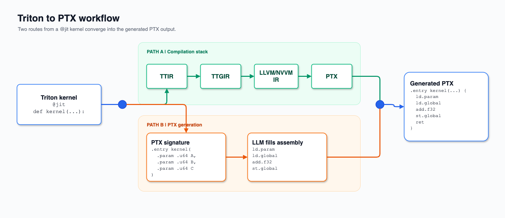
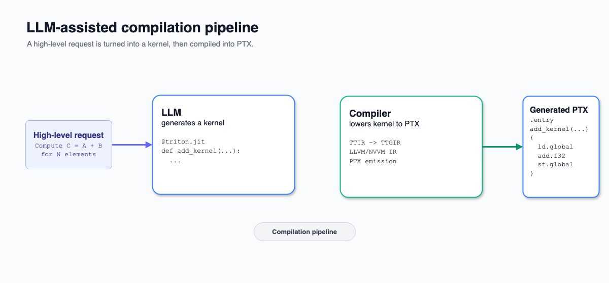

# CompilerBench - can LLM compile code?

<p align="center">
  <strong>Can language models compile GPU kernels better than traditional compilers?</strong>
</p>

<p align="center">
  A benchmark and stateless Openai Gym-style environment for evaluating how agents compile
  <a href="https://triton-lang.org/">Triton</a> kernels directly into NVIDIA PTX.
</p>

<p align="center">
  
  
  
</p>

<p align="center">
  <a href="#why-compilerbench">Why CompilerBench?</a> ·
  <a href="#quick-start">Quick start</a> ·
  <a href="#benchmark">Benchmark</a> ·
  <a href="#scope">Scope</a> ·
  <a href="#contributing">Contributing</a>
</p>

> [!IMPORTANT]
> CompilerBench is an active research project. The environment and evaluation protocol are being released first; complete model results will follow in the accompanying report.

## Overview

CompilerBench asks a deliberately direct question:

> **Given a Triton kernel, can a language model generate a correct PTX implementation that outperforms the code produced by Triton?**

Instead of asking an LLM to select from a fixed library of compiler passes, CompilerBench lets the model emit low-level GPU code directly. Each candidate is assembled, executed, checked for correctness, benchmarked, and compared with a compiler-generated baseline.

The environment is designed for both **evaluation** and **iterative search**. A model can propose a candidate, inspect structured feedback, and improve the implementation over multiple attempts.

<p align="center">
  
</p>

## Why CompilerBench?

Modern GPU compilers are powerful, but their search space is bounded by transformations that compiler engineers have already designed and implemented. Every optimization must also pass conservative legality checks involving aliasing, synchronization, numerical behavior, memory dependencies, and race freedom.

LLMs offer a different path. A model generating PTX directly is not limited to a predefined pass library and may explore combinations of instruction selection, memory access, synchronization, register use, and scheduling that are difficult to express in a conventional optimization pipeline.

<p align="center">
  
</p>

CompilerBench provides the infrastructure needed to test that idea rigorously.

## What the environment does

For each benchmark instance, CompilerBench:

1. Instantiates a Triton kernel with fixed compile-time parameters.
2. Exposes the Triton source and a PTX template with the expected entry-point signature.
3. Accepts a candidate PTX implementation.
4. Assembles and launches the candidate on the target GPU.
5. Checks its outputs against the reference implementation.
6. Measures runtime and returns structured evaluation feedback.

The environment is **stateless**: there is no reset operation and no persistent observable state. Each submitted candidate is evaluated independently.


## Quick start

### Requirements

CompilerBench targets NVIDIA GPUs and PTX. You will need:

- An NVIDIA GPU with a compatible driver and CUDA toolchain
- A Python environment suitable for the project dependencies
- Permission to compile and execute generated GPU code

> [!CAUTION]
> Model-generated PTX is untrusted low-level code. Run evaluations on isolated, non-production infrastructure.

### Install

From a cloned copy of the repository:

```bash
python -m venv .venv
source .venv/bin/activate
python -m pip install --upgrade pip
python -m pip install -e .
```

### Evaluate a candidate

```python
from pathlib import Path

from triton_ptx import (
    Payload,
    TritonPTXCandidateEvaluator,
    resolve_kernel,
)

kernel_cls = resolve_kernel("AddKernel")
evaluator = TritonPTXCandidateEvaluator(kernel_cls)

candidate_ptx = Path("candidate.ptx").read_text()

result = evaluator.evaluate(
    Payload.from_input(
        {
            "ptx": candidate_ptx,
            "threads_x": 128,
        }
    )
)

print(result)
```

The candidate can come from any model or search procedure. CompilerBench is intentionally model-agnostic: it evaluates generated code rather than prescribing how that code is produced.

## Scope

CompilerBench focuses specifically on **low-level code generation and optimization**.

### Fixed by the benchmark

- Triton kernel semantics
- Compile-time constants and launch parameters
- Kernel-launch granularity
- Function signature and calling convention
- Input generation and correctness checks
- Target execution environment

### Open to the model

- PTX instruction selection
- Memory-access strategy
- Register use
- Thread-level execution details
- Synchronization
- Instruction scheduling
- Low-level arithmetic transformations

### Current non-goals

CompilerBench does not currently ask the model to:

- Change block sizes or other compile-time parameters
- Split one Triton kernel into multiple GPU launches
- Rewrite a full PyTorch graph
- Select between cuBLAS, cuDNN, CUTLASS, or other external libraries
- Optimize end-to-end model execution

These choices keep the task narrow enough to measure direct Triton-to-PTX compilation while remaining rich enough to require meaningful hardware-level optimization.

## Why Triton → PTX?

**Triton** is high-level enough to hide many hardware decisions, while still representing a self-contained GPU kernel with explicit parallel semantics.

**PTX** is low-level enough to expose instruction selection, memory operations, synchronization, and thread execution, while remaining structured and automatically assemblable.

This makes Triton-to-PTX a useful middle ground:

| Source | Limitation for this benchmark |
|---|---|
| **PyTorch** | A single operation may involve graph transforms, decomposition, dispatch, fusion, library calls, and several kernels |
| **CUDA C++** | Many thread-block, memory, synchronization, and instruction choices are already explicit |
| **Triton** | Preserves a clear kernel boundary while leaving substantial low-level optimization freedom |


## Research questions

CompilerBench is built to support questions such as:

- How often can frontier models produce valid PTX from Triton?
- How does correctness change with search budget?
- Which kernel families benefit most from model-generated code?
- Can models discover optimizations absent from a compiler's pass library?
- How well do generated implementations transfer across GPU architectures?
- Which feedback signals produce the strongest iterative improvement?


## Contributing

Contributions are welcome, especially in:

- New kernels
- PTX validation and sandboxing
- Reproducible evaluation infrastructure
- Documentation and examples

---

<p align="center">
  <strong>CompilerBench is an experiment in widening the compiler design space.</strong><br>
  If the project helps your research, consider starring the repository and sharing your results.
</p>